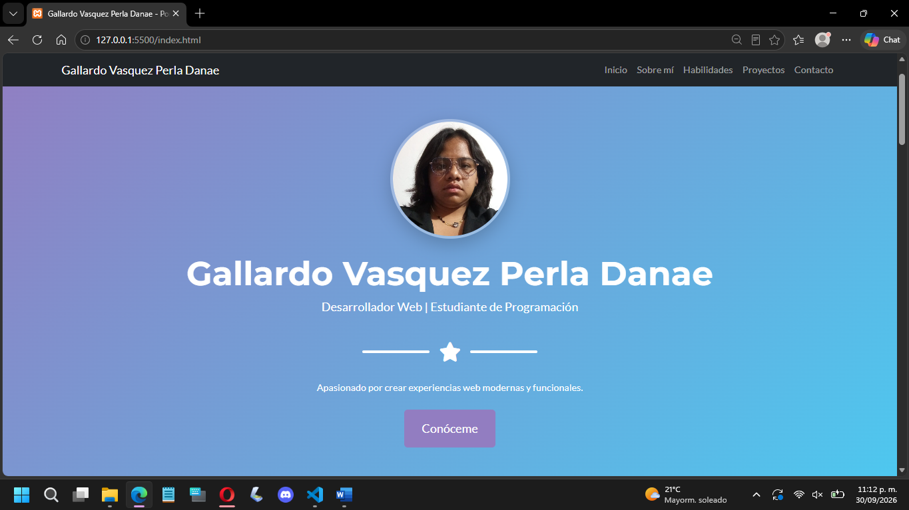
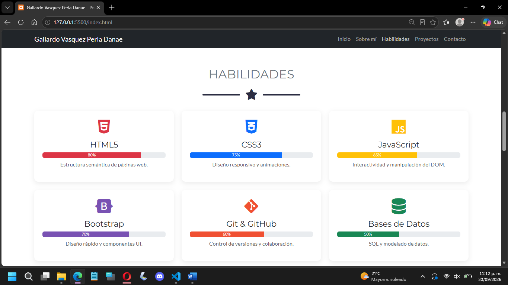
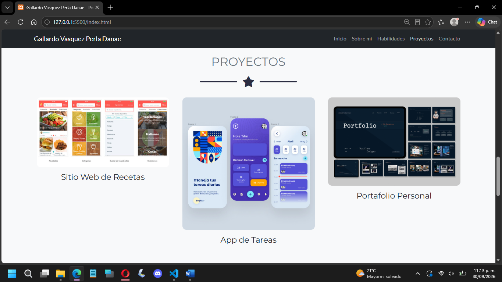
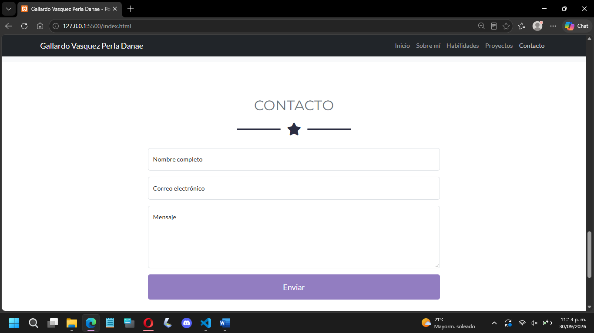

# 🎨 Portafolio Web Personal

**Autor:** Gallardo Vasquez Perla Danae

**Materia:** Programación Web

**Repositorio:** [https://github.com/PerlaD391/Portafolio_web](https://github.com/PerlaD391/portafolio)

**Demo en vivo:** [https://tu-usuario.github.io/portafolio-web/](https://tu-usuario.github.io/portafolio-web/)

---

## 📋 Descripción del Proyecto

Este es mi portafolio web personal, construido con **HTML, CSS, JavaScript y Bootstrap 5**. El objetivo es presentar mi perfil profesional, habilidades técnicas, proyectos destacados y medios de contacto de una forma moderna, responsiva y atractiva.

### 🖼️ Framework CSS Utilizado

**Bootstrap 5** (v5.3.3)

Elegí Bootstrap porque:
- Facilita la creación de diseños responsivos
- Ofrece componentes prediseñados (navbar, modales, formularios)
- Es ampliamente usado en la industria
- Cuenta con excelente documentación

### 📦 Plantilla Base

**Start Bootstrap - Freelancer**

- **Link:** https://startbootstrap.com/theme/freelancer
- **Descripción:** Plantilla de portafolio de una sola página, con diseño limpio, secciones bien definidas y efectos visuales atractivos.

---

## 📑 Secciones del Portafolio

| Sección | Descripción |
|:---|:---|
| **Inicio** | Presentación principal con foto de perfil, nombre, título profesional y botón de llamada a la acción. |
| **Sobre mí** | Breve descripción personal, intereses profesionales y objetivos. |
| **Habilidades** | 6 tarjetas con tecnologías que domino o estoy aprendiendo (HTML, CSS, JavaScript, Bootstrap, Git, Bases de Datos), cada una con icono y barra de progreso. |
| **Proyectos** | 3 proyectos destacados con imagen, título y modal que muestra la descripción completa. |
| **Contacto** | Formulario funcional con validación en JavaScript (nombre, email, mensaje). |
| **Footer** | Información de ubicación, redes sociales y créditos del sitio. |

---

## 🛠️ Proceso de Creación (Paso a Paso)

### Paso 1: Selección de la plantilla
Descargué la plantilla **Freelancer** de Start Bootstrap desde su sitio oficial [citation:7].

### Paso 2: Estructura de archivos
Organicé el proyecto en la siguiente estructura:
```
/portafolio-web
├── index.html
├── /css
│   └── portafolio.css
├── /js
│   └── portafolio.js
└── /img
    └── perfil.jpg
```

### Paso 3: Personalización del contenido
- **Nombre:** Reemplacé el nombre genérico por el mío.
- **Foto:** Agregué mi foto de perfil real y profesional.
- **Secciones:** Adapté cada sección a mi información personal.
- **Habilidades:** Completé con tecnologías que conozco y quiero aprender.
- **Proyectos:** Incluí proyectos reales y planeados.

### Paso 4: Estilos personalizados
En `portafolio.css` agregué:
- Gradiente personalizado en el hero
- Estilos para las tarjetas de habilidades
- Efectos hover en los items del portafolio
- Estilos responsivos para móvil

### Paso 5: JavaScript
En `portafolio.js` implementé:
- Navegación suave (scroll suave)
- Validación del formulario de contacto
- Animación de elementos al hacer scroll
- Año automático en el footer

### Paso 6: Publicación en GitHub Pages
1. Subí todos los archivos a GitHub
2. Fui a **Settings → Pages**
3. Seleccioné la rama `main` y carpeta `/ (root)`
4. Guardé y esperé 1 minuto
5. ¡Listo! El sitio quedó disponible en GitHub Pages

---

## 📸 Capturas de Pantalla

### Sección Inicio


### Sección Habilidades


### Sección Proyectos


### Sección Contacto



---

## 🚀 Cómo Ejecutar el Proyecto

### Opción 1: Abrir directamente
1. Descarga o clona el repositorio
2. Abre `index.html` en tu navegador

### Opción 2: Servidor local
```bash
python -m http.server 5500
```
Luego abre: `http://localhost:5500`

---

## 🧰 Tecnologías Utilizadas

| Tecnología | Uso |
|:---|:---|
| HTML5 | Estructura semántica del sitio |
| CSS3 | Estilos personalizados y responsivos |
| JavaScript | Interactividad y validaciones |
| Bootstrap 5 | Framework CSS para diseño responsivo |
| Font Awesome | Iconos |
| Google Fonts | Tipografías (Montserrat, Lato) |
| Git & GitHub | Control de versiones |
| GitHub Pages | Publicación del sitio |

---

## 📜 Licencia

Este proyecto es de uso libre para fines académicos y personales.

---

## 👤 Autor

**Gallardo Vasquez Perla Danae**
Estudiante de Ingenieria en Sistemas Computacionales
21160634@itoaxaca.edu.mx
